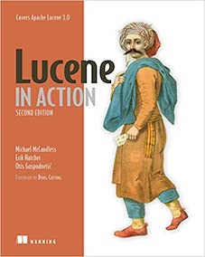

# lucene_in_action_examples
Reimplementation of example codes from the book "lucene in action 2nd edition"

## Intro

Lucene is search engine library written in Java. "Lucene in action" is a book, written by Lucene commiters. It contains detailed explanation about core concepts of lucene and lots of example codes.  

However, the book has been stopped published since 2nd edition, which deals with lucene 3.0. Since recent version of lucene is 8.7, the example codes from the book were all invalidated. So I started to rewrite the example codes in recent version of lucene.  

I tried to rewrite the codes as similar as possible from the original one, in order to avoid confusion. However I skipped some codes related to deprecated APIs. I wrote the skipped parts in /src/main/ch*/readme.md. So before you run the code in every chapter, please read the readme and check which codes are deleted.

## Currently Covered
- ch1. intro
- ch2. index
- ch3. search
- ch4. analyze
- ch5. advanced search

## Contact
- any kind of feedback(questions, contribution, ...) will be welcomed.
- hjkim2246@gmail.com
